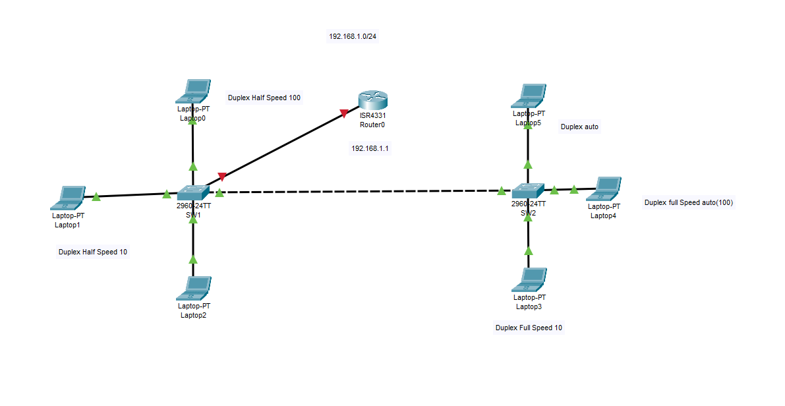

# Duplex
 Duplex and Speed
 
 <b>SW1:</b> Interface FastEthernet0/1 is set to half-duplex (default speed of 100 Mbps)   
     Interface FastEthernet0/2 is set to 10 Mbps and half-duplex.   
<b>SW2:</b> Interface FastEthernet0/1 is set to 10 Mbps   
     Interface FastEthernet0/2 is set to auto speed and auto duplex, so it will automatically negotiate the best settings.
 
 
 ### SW
 Vlan1 interface is configured with IP 192.168.1.2 and subnet mask 255.255.255.0   
FastEthernet0/1 is manually set to half-duplex mode.   
FastEthernet0/2 is manually set to half-duplex and speed 10 Mbps.   
### SW
Vlan1 interface is configured with IP 192.168.1.3 and subnet mask 255.255.255.0.   
FastEthernet0/1 is manually set to speed 10 Mbps.   
FastEthernet0/2 is set to auto speed and auto duplex.   

 

### Switch 1
```
enable
configure terminal
hostname SW1
ip default-gateway 192.168.1.1
interface Vlan1
ip address 192.168.1.2 255.255.255.0
no shutdown
exit
interface FastEthernet0/ 1
duplex half
no shutdown
exit
interface FastEthernet0/ 2
duplex half
speed 10
no shutdown
```


### Switch 2
```
enable
configure terminal
hostname SW2
ip default-gateway 192.168.1.1
interface Vlan1
ip address 192.168.1.3 255.255.255.0
no shutdown
exit
interface FastEthernet0/ 1
speed 10
no shutdown
exit
interface FastEthernet0/ 2
speed auto
no shutdown
exit
interface FastEthernet0/ 2
duplex auto
no shutdown
exit
exit
```


### show interfaces SW1

```
int f0/1
Half-duplex, 100Mb/s
int f0/2
Half-duplex, 10Mb/s
int f0/3
 Full-duplex, 100Mb/s
 ```
 
 ### show interfaces SW2
 ```
 int f0/1
 Full-duplex, 10Mb/s
 int f0/2
 Full-duplex, 100Mb/s
 int f0/3
  Full-duplex, 100Mb/s
  ```


